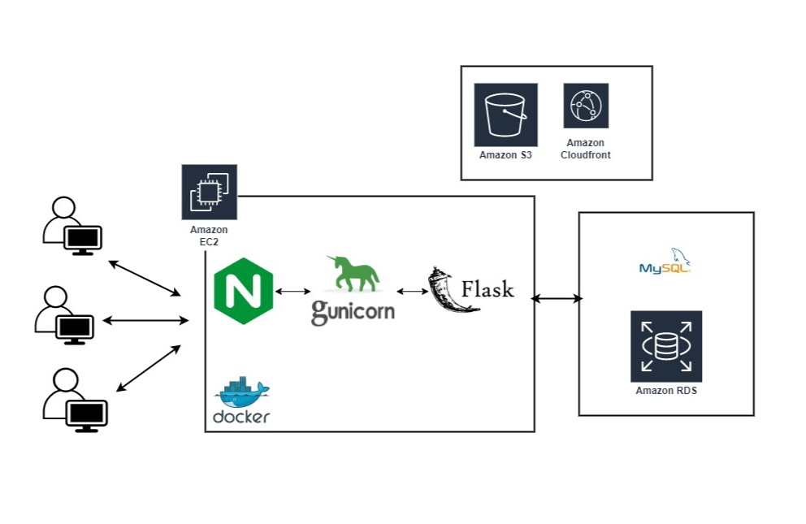
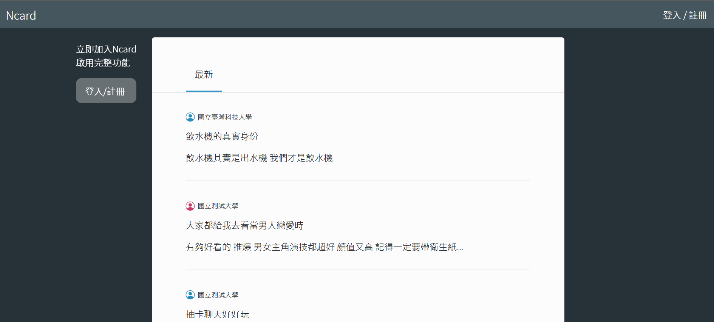
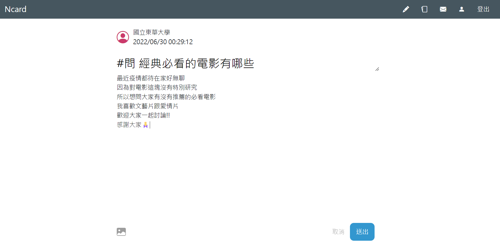
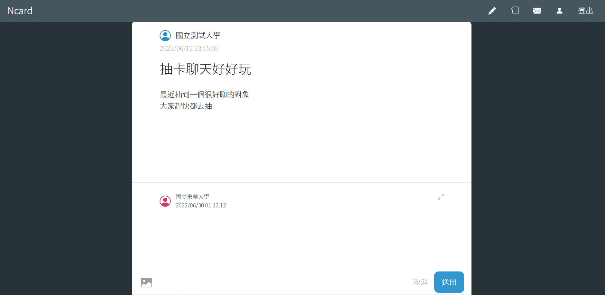
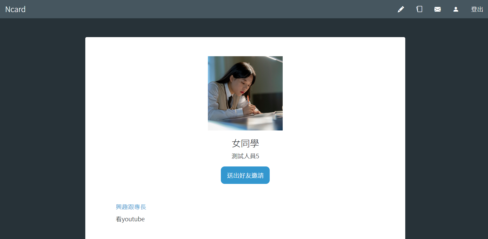

# Ncard

Dcard as a reference, users can post comments, share ideas, meet new friends, match with someone, and start a conversation.

## Demo

---

Website URL : https://ncard.website/

Test Account

Email：test@test.com

Password：test

## Technique

---

### Frontend

- HTML
- CSS
- JavaScript

### Backend

- Python Flask for server framework.
- Creating a real-time chat with Socket.io.
- Using AWS S3 to store the images and CloudFront CDN to serve images fast.
- Using RDS for MySQL database to store data and normalize a database structure in 3NF.
- Using indexes to improve MySQL query performance.
- Using Nginx as A Reverse Proxy with SSL.
- Deploying web applications with Docker.
- Setting a crontab to run Ncard matching and write to a database.
- Design web APIs follow REST.

## System Architecture

---

## Introduction

---

### Browse articles

- Homepage showing the latest articles.

  

### Share ideas

- After registration and filling out basic information, users can write an article and post comments.

  

  

### Match-making

- Every midnight, users would be paired up with a stranger randomly assigned.
- Users will only meet each person one time, once the opportunity has passed, it is gone forever.
- As long as both users hit the button and agree to meet each other they can be friends.

### Chat

- After users become friends, they can start a conversation and exchange information.

